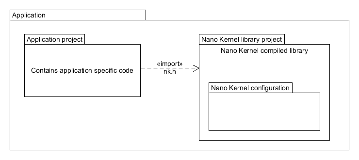
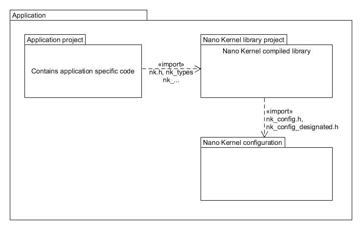

# Application development

This document describes a typical application development cycle and how are Nano Kernel options 
configured for each development cycle.

# Development cycles

Typical software development start with:
1. __Analysis cycle__ - The requirement collection is the first stage in the application development 
   process. It is performed by the a team of business analysts, technical architects and project 
   managers together with all the stakeholders. It is also very beneficial to the project to include 
   domain experts in the industry during these initial steps.
2. __Project Design__ - Based on the requirements collection the team prepares the system and 
   software design to define the whole system architecture. This design phase will be a base for the 
   next coding phase. At this moment some ruff estimations can be made for resource usage (such as 
   number of threads, timers, pools, etc).
3. __Implementation__ - This is the longest phase of the software development life cycle. During 
   this phase more exact estimations are made on the needed resources. At this moment typical 
   application configuration has the following settings:
   - NK_CONFIG__ERROR_PRE_EN set to 1
   - NK_CONFIG__ERROR_POST_EN set to 1

4. __Testing__ - Once some part of the software implementation is complete, it is tested by the QA 
   team. During this phase typical applicaiton configuration also has the following set:
   - NK_CONFIG__PROFILING_EN set to 1
5. __Release__ - Once the software is developed and fully tested, the final deployments process is 
   launched. Typicall application configuration disables the following options:
   - NK_CONFIG__ERROR_PRE_EN set to 0
   - NK_CONFIG__ERROR_PROFILING_EN set to 0
   
   Some applications might even disable postcondition error handling:
   - NK_CONFIG__ERROR_POST_EN set to 0
6. __Maintainance__ - After the release, the application continues its cycle in the following ways:
    - bug fixing
    - software upgrade
    - enhancement with new features

# Application project architectures

## Single project application architecture

This is the most common project architecture. All the application and Nano Kernel sources are part
of one single project. Nano Kernel source is just a subfolder to application code base.

## Multiple projects applications architecture

It is possible to use and compile Nano Kernel sources as a library. The library is compiled as a
separate project which is only a part of the application. There are some limitations to this 
approach and the limitation dependend on the way the Nano Kernel sources are used:
- application code uses only `nk.h` header file
- application code uses other Nano Kernel headers as well 

### Application code uses only nk.h header file

In this configuration none of the Nano Kernel configuration details are exported outside the public
API. This is the cleanest way of using the Nano Kernel sources and it allows for easy compilation of
Nano Kernel sources as a library.

### Application code uses other Nano Kernel headers as well

In this configuration the application also uses protected Nano Kernel headers which are including 
the Nano Kernel configuration, too. For this reason, a 3rd project, which contains the 
configuration, needs to be created.

# Application main function

The main() function is normal function. Once the execution reaches main() there is a recommended 
order to initialize the hardware and start the kernel. This is also reflected in the user code 
template files.

The application's main() should implement at least the following in the given order:

* Initialization and configuration of hardware including peripherals, memory, pins, clocks and the 
  interrupt system.
* Initialize the NK kernel using nk_kernel__init() function.
* Optionally, create at least one thread (for example app_main), which is used as a main thread 
  using nk_thread__create() function. This thread should take care of creating and starting objects, 
  once it is run by the scheduler. Alternatively, threads can be created in main() function
  directly.
* Start the NK kernel using nk_kernel__start() which also configures the system tick timer and 
  initializes NK specific interrupts. This function does not return in case of successful execution. 
  Therefore, any application code after nk_kernel__start() will not be executed.

__Note__:

* Before executing any function from NK the function nk_kernel__init() must be called.

