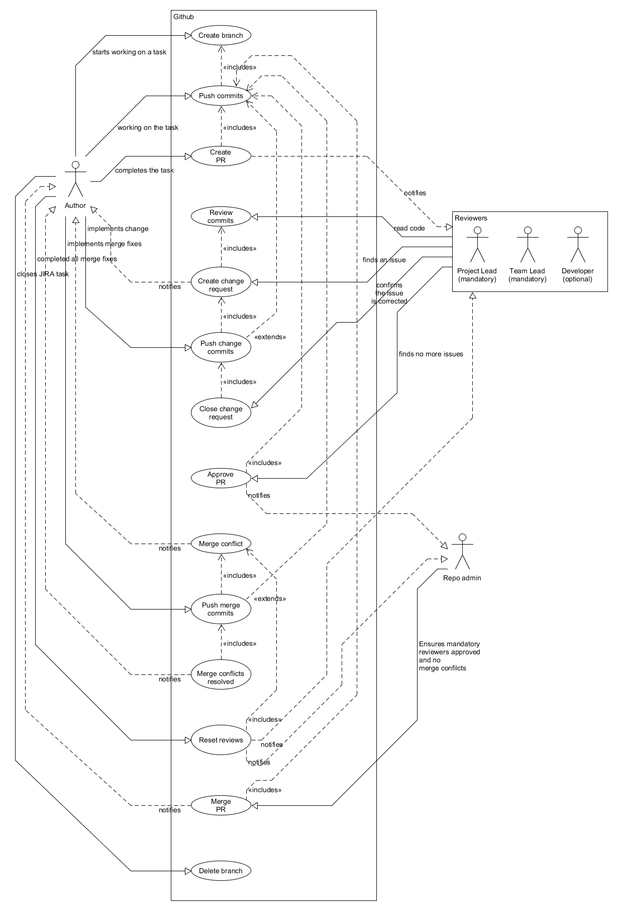

# NK Development pull requests (PR)

# Intro

__Intended audience__ of this document: 

* Developers who work on Nano Kernel sources (required).
* Testers who test Nano Kernel sources (informative).

This document describes the pull request use-cases.

## Detailed use case

The Author/Reviewer(s)/Repo admin workflow is the following:

1. When __Author__ starts working on a task it first creates a branch.
2. While working on the task it pushes commits to the branch created in step 1.
3. When the __Author__ completes the task it creates a PR with a description and specifies the 
   reviewers in the __Reviewers__ group. This creates a notification for involved reviewers. 
   __Author__ and __Repo Admin__ are waiting on __Reviewers__ approval(s).
4. Once notified, all reviewers review the commits by reading the code.
5. If a reviewer from __Reviewers__ group find an issue it will create a change request. This is 
   done by creating a comment for code or file. This creation notifies __Author__ that it needs to 
   take an action.
6. __Author__ implements changes and pushes the change commits on the same branch.
7. __Reviewers__ review the commits again and confirms the issue is corrected by closing the change 
   request.
8. When __Reviewers__ finds no more issues it will approve the PR. This generates notification for 
   __Repo Admin__. At this point __Repo Admin__ will evaluate if all mandatory reviews and approvals 
   are in place. If not, it still waits for reviews and approvals of other reviewers in 
   __Reviewers__.
9. During a code review a merge conflict may arrise. This merge conflict is detected by repository 
   and the repository notifies the __Author__.
10. __Author__ implements merge fixes and pushes the merge commits to the same branch.
11. Once merge conflicts are resolved the repository notifies the __Author__.
12. __Author__ has completed all merge fixes and then resets the review(s). This creates another 
    batch of notification for __Reviewers__ and __Repo Admin__. Since the review process is 
    restarted actors go through steps 4 to 8.
13. Once all issues are resolved and all reviews and approvals are in place __Repo Admin__ may 
    initiate merge procedure. Once the merging is done the repository will notify __Author__.
14. __Author__ closes the task and proceedes to delete the branch created in step 1. This step 
    completes the PR procedure.
